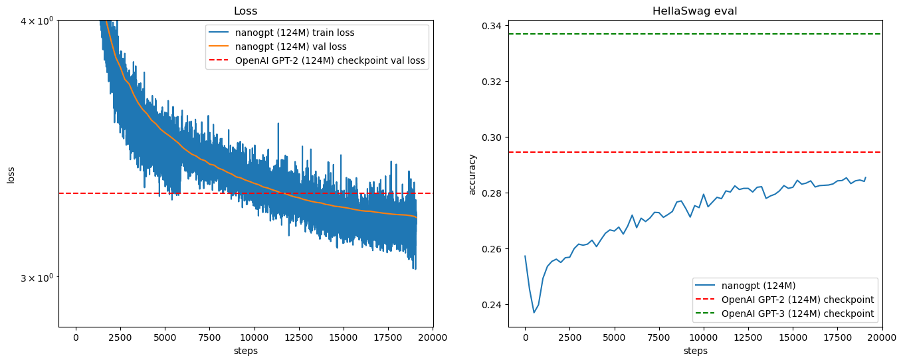

## 📖 Overview

This project implements GPT-2(124M) from scratch by combining:
- **GPT-2 inference code** (OpenAI) - for model architecture
- **GPT-3 hyperparameters** (OpenAI paper) - for training details

The GPT-2 paper provided code but lacked detailed training hyperparameters, while GPT-3 paper provided extensive training details but no code. This implementation bridges both to create a reproducible GPT-2 training setup.

## 🎯 Features

### Based on Original Tutorial
Following the excellent tutorial by Andrej Karpathy:
- **Source**: [Let's reproduce GPT-2 (124M)](https://www.youtube.com/watch?v=l8pRSuU81PU)
- Implemented GPT-2 architecture from scratch
- Applied GPT-3 training hyperparameters
- Used FineWeb-Edu dataset for training

### My Contributions
Beyond the tutorial, I added:
- ✅ **Bug fixes** - Resolved issues not addressed in original video
- ✅ **Modularized architecture** - Organized into `models/`, `data/`, `utils/`, `configs/`
- ✅ **Weights & Biases integration** - Real-time experiment tracking
  - Automatic model graph visualization
  - Gradient flow monitoring
  - Loss/Perplexity tracking
  - System metrics (GPU/CPU usage)
- ✅ **Bug fixes** - Fixed `torch.compile()` conflict with HellaSwag evaluation
- ✅ **Production-ready code** - Clean, maintainable, and scalable

## 📊 Results

Training on **edu_fineweb10B** dataset with **8x NVIDIA A100 GPUs** completed in **under 3 hours**.

### Final Metrics
- **Min Training Loss**: 3.0246
- **Min Validation Loss**: 3.2055
- **Max HellaSwag Accuracy**: 0.2854 (28.54%)



The chart shows:
- **Validation Loss** over training steps
- **HellaSwag Accuracy** (common sense reasoning benchmark)
- Comparison with GPT-2 and GPT-3 baseline results

### Generated Samples

After training, the model generates coherent text from the prompt `"Hello, I'm a language model,"`:

```
Sample 0: Hello, I'm a language model, and I love to use Python in different tasks.
          In this blog I'll go over what Python's natively called "

Sample 1: Hello, I'm a language model, so a human being would be able to understand
          it using English, it would understand the meaning of words to a human being

Sample 2: Hello, I'm a language model, I'm trained on Microsoft's Xbox, Apple's Xbox.
          And so I'm the world's first language model,

Sample 3: Hello, I'm a language model, which is a model of the world and a specific
          language. If you are on your native language, you are talking
```

## 🚀 Quick Start

### Prerequisites

```bash
# Create virtual environment
python -m venv venv
source venv/bin/activate  # On Windows: venv\Scripts\activate

# Install dependencies
pip install -r requirements.txt

# (Optional) Setup Weights & Biases
pip install wandb
wandb login
```

### Training

#### Single GPU
```bash
python train.py
```

#### Multi-GPU (Distributed Data Parallel)
```bash
# 8 GPUs
torchrun --standalone --nproc_per_node=8 train.py

# 4 GPUs
torchrun --standalone --nproc_per_node=4 train.py

# Custom configuration
torchrun --standalone --nproc_per_node=<NUM_GPUS> train.py
```

### Configuration

Edit `configs/config.py` to customize:
- Model size (layers, heads, embedding dimension)
- Training hyperparameters (learning rate, batch size, steps)
- Weights & Biases settings

Example:
```python
# configs/config.py
@dataclass
class TrainingConfig:
    # Model settings
    n_layer: int = 12
    n_head: int = 12
    n_embd: int = 768

    # Training settings
    max_steps: int = 19073
    max_lr: float = 6e-4

    # Weights & Biases
    use_wandb: bool = True
    wandb_project: str = "nanogpt2"
```

## 📁 Project Structure

```
build_nanogpt2/
├── models/
│   ├── __init__.py
│   ├── layers.py          # CausalSelfAttention, MLP, Block
│   └── gpt.py             # GPT, GPTConfig
├── data/
│   ├── __init__.py
│   └── dataloader.py      # DataLoaderLite
├── utils/
│   ├── __init__.py
│   ├── training.py        # Training utilities (LR scheduler, optimizer)
│   ├── evaluation.py      # Evaluation functions
│   ├── logger.py          # TrainingLogger (with wandb support)
│   └── visualization.py   # Visualization utilities
├── configs/
│   ├── __init__.py
│   └── config.py          # TrainingConfig
├── train.py               # Main training script (modularized)
├── train_gpt2.py          # Original monolithic script
├── hellaswag.py           # HellaSwag evaluation
└── fineweb.py             # Data preprocessing
```

## 📚 Dataset

Training uses the **edu_fineweb10B** dataset - a high-quality educational subset of web text.

To prepare your own dataset:
```bash
python fineweb.py
```

## 📖 Blog Post

For detailed walkthrough and insights, check out my blog post:
- **[Korean]** [https://blog.naver.com/gettingwetinseu/224054116922]

## 🙏 Acknowledgments

This project is built upon the excellent work by:
- **Andrej Karpathy** - Original tutorial: [Let's reproduce GPT-2 (124M)](https://www.youtube.com/watch?v=l8pRSuU81PU)
- **OpenAI** - GPT-2 and GPT-3 papers and code
- **HuggingFace** - Datasets and FineWeb-Edu

## 📄 License

MIT License - see LICENSE file for details

## 🔗 References

- [Original Tutorial](https://github.com/karpathy/build-nanogpt)
